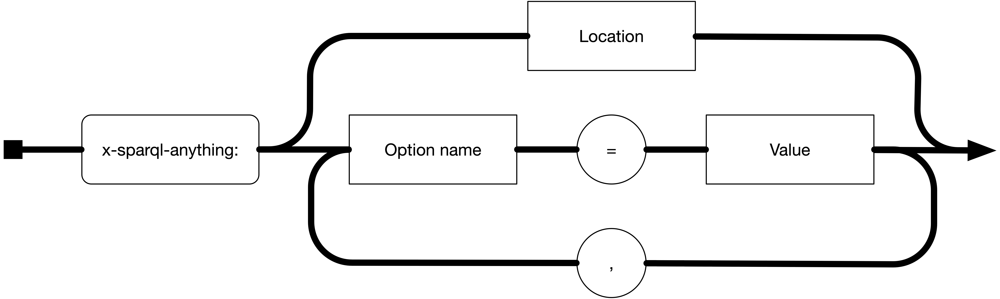

[](https://zenodo.org/badge/latestdoi/303967701)
[](https://opensource.org/licenses/Apache-2.0)
[](https://github.com/sparql-anything/sparql.anything/actions/workflows/maven_Java17.yml)
[](https://github.com/SPARQL-Anything/sparql.anything/actions/workflows/codeql-analysis.yml)
[](#usage)
[](https://forms.gle/t1paTLz7jVu3RYnu8)

# SPARQL Anything

SPARQL Anything is a system for Semantic Web re-engineering that allows users to ... query anything with SPARQL.

## Quickstart

One of the most common uses of SPARQL Anything is to start with some structured data (e.g. csv) and produce RDF using a particular ontology (e.g. [gist](https://github.com/semanticarts/gist)).
Here is how that can be done.

```bash
# have java and curl installed
$ curl -L -O 'https://github.com/SPARQL-Anything/sparql.anything/releases/download/0.9.0/sparql-anything-0.9.0.jar'
```

```csv
$ cat some.csv
id,name,height_inches
5,alice,66
2,fred,67
9,william,73
```

```sparql
# first let's write a simple query that just shows us the Facade-X representaion of the csv
$ cat some.rq 
PREFIX  xyz:  <http://sparql.xyz/facade-x/data/>
PREFIX  fx:   <http://sparql.xyz/facade-x/ns/>
CONSTRUCT { ?s ?p ?o  }
WHERE
  { SERVICE <x-sparql-anything:>
      { fx:properties
                  fx:location     "some.csv" ;
                  fx:csv.headers  "true" .
        ?s        ?p              ?o
      }
  }
```

```turtle
$ java -jar sparql-anything-0.9.0.jar --query some.rq 
[main] INFO com.github.sparqlanything.cli.SPARQLAnything - SPARQL anything
@prefix fx:  <http://sparql.xyz/facade-x/ns/> .
@prefix xyz: <http://sparql.xyz/facade-x/data/> .

[ a       fx:root ;
  <http://www.w3.org/1999/02/22-rdf-syntax-ns#_1>
          [ xyz:height_inches  "66" ;
            xyz:id             "5" ;
            xyz:name           "alice"
          ] ;
  <http://www.w3.org/1999/02/22-rdf-syntax-ns#_2>
          [ xyz:height_inches  "67" ;
            xyz:id             "2" ;
            xyz:name           "fred"
          ] ;
  <http://www.w3.org/1999/02/22-rdf-syntax-ns#_3>
          [ xyz:height_inches  "73" ;
            xyz:id             "9" ;
            xyz:name           "william"
          ]
] .
```

```sparql
# and now you can use everything you know about SPARQL to construct the RDF you want
# by transforming the Facade-X representaion into the desired RDF
$ cat some.rq
PREFIX  xyz:  <http://sparql.xyz/facade-x/data/>
PREFIX  fx:   <http://sparql.xyz/facade-x/ns/>
PREFIX  ex:   <http://example.com/>
PREFIX  xsd:  <http://www.w3.org/2001/XMLSchema#>
PREFIX  gist: <https://w3id.org/semanticarts/ns/ontology/gist/>
CONSTRUCT {
?person a gist:Person ;
  gist:name ?name ;
  gist:hasMagnitude ?height_magnitude .
?height_magnitude a gist:Extent ;
  gist:hasUnitOfMeasure gist:_inch ;
  gist:numericValue ?height .
}
WHERE
  { SERVICE <x-sparql-anything:>
      { fx:properties
                  fx:location     "some.csv" ;
                  fx:csv.headers  "true" .
        ?row xyz:height_inches ?height_string .
        ?row xyz:id ?id_string .
        ?row xyz:name ?name .
        bind(bnode() as ?height_magnitude)
        bind(xsd:float(?height_string) as ?height)
        bind(iri(concat(str(ex:),"Person/",?id_string)) as ?person)
      }
  }
```

```turtle
$ java -jar sparql-anything-0.9.0.jar --query some.rq
@prefix ex:   <http://example.com/> .
@prefix fx:   <http://sparql.xyz/facade-x/ns/> .
@prefix gist: <https://w3id.org/semanticarts/ns/ontology/gist/> .
@prefix xsd:  <http://www.w3.org/2001/XMLSchema#> .
@prefix xyz:  <http://sparql.xyz/facade-x/data/> .

<http://example.com/Person/9>
        a                  gist:Person ;
        gist:hasMagnitude  [ a                      gist:Extent ;
                             gist:hasUnitOfMeasure  gist:_inch ;
                             gist:numericValue      "73"^^xsd:float
                           ] ;
        gist:name          "william" .

<http://example.com/Person/2>
        a                  gist:Person ;
        gist:hasMagnitude  [ a                      gist:Extent ;
                             gist:hasUnitOfMeasure  gist:_inch ;
                             gist:numericValue      "67"^^xsd:float
                           ] ;
        gist:name          "fred" .

<http://example.com/Person/5>
        a                  gist:Person ;
        gist:hasMagnitude  [ a                      gist:Extent ;
                             gist:hasUnitOfMeasure  gist:_inch ;
                             gist:numericValue      "66"^^xsd:float
                           ] ;
        gist:name          "alice" .
```

## Main features

- Provides a homogeneous view over heterogeneous  data sources, thanks to the Facade-X meta-model (see [Facade-X specification](Facade-X.md) and [System overview](SystemOverview.md) )
- Query files in plain SPARQL 1.1, via the `SERVICE <x-sparql-anything:>` (see [configuration](#Configuration)) and
  build knowledge graphs with `CONSTRUCT` queries
- [Supported formats](#supported-formats): XML, JSON, CSV, HTML, Excel, Text, Binary, EXIF, File System, Zip/Tar,
  Markdown, YAML, Bibtex, DOCx, PPTX (see [pages dedicated to single formats](#supported-formats))
- Transforms [files, inline content, or the output of an external command](#general-purpose-options)
- Generates RDF, RDF-Star, and tabular data (thanks to SPARQL)
- Full-fledged [HTTP client](Configuration.md#http-options) to query Web APIs (headers, authentication, all methods
  supported)
- [Functions library](#functions-and-magic-properties) for RDF sequences, strings, hashes, easy entity building, ...
- Combine multiple SERVICE clauses into complex data integration queries (thanks to SPARQL)
- Query templates (using [BASIL variables](#query-templates-and-variable-bindings))
- Save and reuse SPARQL `Results Sets` as input for [parametric queries](#query-templates-and-variable-bindings)
- Slice large CSV, JSON and XML files with an iterator-like execution style (
  see [#202](https://github.com/SPARQL-Anything/sparql.anything/issues/202)
  and [#203](https://github.com/SPARQL-Anything/sparql.anything/issues/203))
- Supports an [on-disk option](#Configuration) (with Apache Jena TDB2)

## Introduction

SPARQL Anything uses a single generic abstraction for all data source formats called Facade-X.

### Facade-X

Facade-X is a simplistic meta-model used by SPARQL Anything transformers to generate RDF data from diverse data sources.
Intuitively, Facade-X uses a subset of RDF as a general approach to represent the source content *as-it-is* but in RDF.
The model combines two types of elements: containers and literals.
Facade-X always has a single root container.
Container members are a combination of key-value pairs, where keys are either RDF properties or container membership
properties.
Instead, values can be either RDF literals or other containers.
This is a generic example of a Facade-X data object (more examples below):

```turtle
@prefix fx: <http://sparql.xyz/facade-x/ns/> .
@prefix xyz: <http://sparql.xyz/facade-x/data/> .
@prefix rdf: <http://www.w3.org/1999/02/22-rdf-syntax-ns#> .
[] a fx:root ; rdf:_1 [
    xyz:someKey "some value" ;
    rdf:_1 "another value with unspecified key" ;
    rdf:_2 [
        rdf:type xyz:MyType ;
        rdf:_1 "another value"
    ]
] .
```

More details on the Facade-X metamodel can be found [here](Facade-X.md).

### Querying anything

SPARQL Anything extends the Apache Jena ARQ processors by *overloading* the SERVICE operator, as in the following
example:

Suppose having this JSON file as input (also available at ``https://sparql-anything.cc/example1.json``)

```json
[
  {
    "name": "Friends",
    "genres": [
      "Comedy",
      "Romance"
    ],
    "language": "English",
    "status": "Ended",
    "premiered": "1994-09-22",
    "summary": "Follows the personal and professional lives of six twenty to thirty-something-year-old friends living in Manhattan.",
    "stars": [
      "Jennifer Aniston",
      "Courteney Cox",
      "Lisa Kudrow",
      "Matt LeBlanc",
      "Matthew Perry",
      "David Schwimmer"
    ]
  },
  {
    "name": "Cougar Town",
    "genres": [
      "Comedy",
      "Romance"
    ],
    "language": "English",
    "status": "Ended",
    "premiered": "2009-09-23",
    "summary": "Jules is a recently divorced mother who has to face the unkind realities of dating in a world obsessed with beauty and youth. As she becomes older, she starts discovering herself.",
    "stars": [
      "Courteney Cox",
      "David Arquette",
      "Bill Lawrence",
      "Linda Videtti Figueiredo",
      "Blake McCormick"
    ]
  }
]
```

With SPARQL Anything you can select the TV series starring "Courteney Cox" with the SPARQL query

```sparql
PREFIX xyz: <http://sparql.xyz/facade-x/data/>
PREFIX rdf: <http://www.w3.org/1999/02/22-rdf-syntax-ns#>
PREFIX fx: <http://sparql.xyz/facade-x/ns/>

SELECT ?seriesName
WHERE {

    SERVICE <x-sparql-anything:https://sparql-anything.cc/example1.json> {
        ?tvSeries xyz:name ?seriesName .
        ?tvSeries xyz:stars ?star .
        ?star fx:anySlot "Courteney Cox" .
    }

}
```

and get this result without caring of transforming JSON to RDF.

| seriesName    |
|---------------|
| "Cougar Town" |
| "Friends"     |

### Using the Command Line Interface

SPARQL Anything requires `Java >= 11` to be installed in your operating system.
Download the latest version of the SPARQL Anything command line from
the [releases page](https://github.com/SPARQL-Anything/sparql.anything/releases).
The command line is a file named `sparql-anything-<version>.jar`.
Prepare a file with the query above and name it, for example `query.sparql`.
The query can be executed as follows:

```bash
java -jar sparql-anything-<version>.jar -q query.sparql
```

See the [usage section](#Usage) for details on the command line interface.

### Using the server

SPARQL Anything is also released as a server, embedded into an instance of the Apache Jena Fuseki server.
The server requires `Java >= 11` to be installed in your operating system.
Download the latest version of the SPARQL Anything server from
the [releases page](https://github.com/SPARQL-Anything/sparql.anything/releases).
The command line is a file named `sparql-anything-server-<version>.jar`.

Run the server as follows:

```bash
$ java -jar sparql-anything-server-<version>.jar 
[main] INFO io.github.sparqlanything.fuseki.Endpoint - sparql.anything endpoint
[main] INFO io.github.sparqlanything.fuseki.Endpoint - Starting sparql.anything endpoint..
[main] INFO io.github.sparqlanything.fuseki.Endpoint - The server will be listening on http://localhost:3000/sparql.anything
[main] INFO io.github.sparqlanything.fuseki.Endpoint - The server will be available on http://localhost:3000/sparql
[main] INFO org.eclipse.jetty.server.Server - jetty-10.0.6; built: 2021-06-29T15:28:56.259Z; git: 37e7731b4b142a882d73974ff3bec78d621bd674; jvm 11.0.10+9
[main] INFO org.eclipse.jetty.server.handler.ContextHandler - Started o.e.j.s.ServletContextHandler@782a4fff{org.apache.jena.fuseki.Servlet,/,null,AVAILABLE}
[main] INFO org.eclipse.jetty.server.AbstractConnector - Started ServerConnector@c7a975a{HTTP/1.1, (http/1.1)}{0.0.0.0:3000}
[main] INFO org.eclipse.jetty.server.Server - Started Server@35beb15e{STARTING}[10.0.6,sto=0] @889ms
[main] INFO org.apache.jena.fuseki.Server - Start Fuseki (http=3000)

```

Access the SPARQL UI at the address `http://localhost:3000/sparql`, where you can copy the query above and execute it.
See the [usage section](#Usage) for details on the SPARQL Anything Fuseki server.

## Supported Formats

Currently, SPARQL Anything supports the following list of formats but the possibilities are limitless!
The data is interpreted as in the following examples (using default settings).

A detailed description of the interpretation can be found in the following pages:

- [JSON](formats/JSON.md)
- [HTML](formats/HTML.md)
- [CSV](formats/CSV.md)
- [XML](formats/XML.md)
- [Binary](formats/Binary.md)
- [Text](formats/Text.md)
- [Markdown](formats/Markdown.md)
- [File system and archives (ZIP, Tar)](formats/Archive.md)
- [Spreadsheets: XLS, XLSx](formats/Spreadsheet.md)
- [Documents: DOCx](formats/Docs.md)
- [EXIF Metadata](formats/Metadata.md)
- [Bibliography](formats/Bibliography.md)
- [YAML](formats/YAML.md)
- [Slides](formats/Slides.md)

... and, of course, the triples generated from the these formats can be integrated with the content of
any [RDF Static file](formats/RDF.md)

## Configuration

SPARQL Anything behaves as a standard SPARQL query engine.
For example, the SPARQL Anything server will act as a virtual endpoint that can be queried exactly as a remote SPARQL
endpoint.
In addition, SPARQL Anything provides a rich Command Line Interface (CLI).
For information for how to run SPARQL Anything, please see the [quickstart](README.md#Quickstart)
and [usage](README.md#usage) sections of the documentation.

### Passing triplification options via SERVICE IRI

In order to instruct the query processor to delegate the execution to SPARQL Anything, you can use the following
IRI-schema within SERVICE clauses.
A minimal URI that uses only the resource locator is also possible.
In this case SPARQL Anything guesses the data source type from the file extension.



**Note:** Use the `file://` protocol to reference local files

### Passing triplification options via Basic Graph Pattern

Alternatively, options can be provided as basic graph pattern inside the SERVICE clause as follows

```sparql
PREFIX xyz: <http://sparql.xyz/facade-x/data/>
PREFIX rdf: <http://www.w3.org/1999/02/22-rdf-syntax-ns#>
PREFIX fx: <http://sparql.xyz/facade-x/ns/>

SELECT ?seriesName
WHERE {

    SERVICE <x-sparql-anything:> {
        fx:properties fx:location "https://sparql-anything.cc/example1.json" .
        ?tvSeries xyz:name ?seriesName .
        ?tvSeries xyz:stars ?star .
        ?star fx:anySlot "Courteney Cox" .
    }

}
```

Note that

1. The SERVICE IRI scheme must be ``x-sparql-anything:``.
2. Each triplification option to pass to the engine corresponds to a triple of the Basic Graph Pattern inside the
   SERVICE clause.
3. Such triples must have ``fx:properties`` as subject, ``fx:[OPTION-NAME]`` as predicate, and a literal or a variable
   as object.

You can also mix the two modalities as follows.

```sparql
PREFIX xyz: <http://sparql.xyz/facade-x/data/>
PREFIX rdf: <http://www.w3.org/1999/02/22-rdf-syntax-ns#>
PREFIX fx: <http://sparql.xyz/facade-x/ns/>

SELECT ?seriesName
WHERE {

    SERVICE <x-sparql-anything:blank-nodes=false> {
        fx:properties fx:location "https://sparql-anything.cc/example1.json" .
        ?tvSeries xyz:name ?seriesName .
        ?tvSeries xyz:stars ?star .
        ?star fx:anySlot "Courteney Cox" .
    }

}
```

### General purpose options

| Option name                                                                         | Description                                                                                                                                                                                                                                                                                                                                   | Valid Values                                                                                                                                                                          | Default Value                                                                                                                                                                                                                                                               |
|-------------------------------------------------------------------------------------|-----------------------------------------------------------------------------------------------------------------------------------------------------------------------------------------------------------------------------------------------------------------------------------------------------------------------------------------------|---------------------------------------------------------------------------------------------------------------------------------------------------------------------------------------|-----------------------------------------------------------------------------------------------------------------------------------------------------------------------------------------------------------------------------------------------------------------------------|
| [location](Configuration.md#location)*                                              | The URL of the data source.                                                                                                                                                                                                                                                                                                                   | Any valid URL or (absolute or relative) path of the file system.                                                                                                                      | \*                                                                                                                                                                                                                                                                          |
| [content](Configuration.md#content)*                                                | The content to be transformed.                                                                                                                                                                                                                                                                                                                | Any valid literal.                                                                                                                                                                    | \*                                                                                                                                                                                                                                                                          |
| [command](Configuration.md#command)*                                                | An external command line to be executed. The output is handled according to the option 'media-type'                                                                                                                                                                                                                                           | Any valid literal.                                                                                                                                                                    | \*                                                                                                                                                                                                                                                                          |
| [read-from-std-in](Configuration.md#read-from-std-in)*                              | It tells SPARQL Anything to read the content to be transformed from standard input (see issue [#244](https://github.com/SPARQL-Anything/sparql.anything/issues/244))                                                                                                                                                                          | true/false                                                                                                                                                                            | false                                                                                                                                                                                                                                                                       |
| [from-archive](Configuration.md#from-archive)                                       | The filename of the resource to be triplified within an archive.                                                                                                                                                                                                                                                                              | Any filename.                                                                                                                                                                         | No value                                                                                                                                                                                                                                                                    |
| [root](Configuration.md#root)                                                       | The IRI of generated root resource. The root will be used as a namespace for the graphs and containers that will be generated.                                                                                                                                                                                                                | Any valid IRI.                                                                                                                                                                        | location  (in the case of location argument  set) <br/> **or** <br/> 'http://sparql.xyz/facade-x/data/' + md5Hex(content) (in the case of content argument set) <br/>**or**<br/> 'http://sparql.xyz/facade-x/data/' + md5Hex(command) (in the case of command argument set) |
| [media-type](Configuration.md#media-type)                                           | The media-type of the data source.                                                                                                                                                                                                                                                                                                            | Any valid [Media-Type](https://en.wikipedia.org/wiki/Media_type).  Supported media types are specified in the [pages dedicated to the supported formats](README.md#supported-formats) | No value (the media-type will be guessed from the the file extension)                                                                                                                                                                                                       |
| [namespace](Configuration.md#namespace)                                             | The namespace prefix for the properties and classes that will be generated.                                                                                                                                                                                                                                                                   | Any valid namespace prefix.                                                                                                                                                           | http://sparql.xyz/facade-x/data/                                                                                                                                                                                                                                            |
| [blank-nodes](Configuration.md#blank-nodes)                                         | It tells SPARQL Anything to generate blank nodes or not.                                                                                                                                                                                                                                                                                      | true/false                                                                                                                                                                            | true                                                                                                                                                                                                                                                                        |
| [trim-strings](Configuration.md#trim-strings)                                       | Trim all string literals.                                                                                                                                                                                                                                                                                                                     | true/false                                                                                                                                                                            | false                                                                                                                                                                                                                                                                       |
| [null-string](Configuration.md#null-string)                                         | Do not produce triples where the specified string would be in the object position of the triple.                                                                                                                                                                                                                                              | Any string                                                                                                                                                                            | No value                                                                                                                                                                                                                                                                    |
| [http.*](Configuration.md#http-options)                                             | A set of options for customising HTTP request method, headers, querystring, and others. [More details on the HTTP request configuration](Configuration.md#http-options)                                                                                                                                                                       | No value                                                                                                                                                                              |
| [triplifier](Configuration.md#triplifier)                                           | It forces SPARQL Anything to use a specific triplifier for transforming the data source                                                                                                                                                                                                                                                       | A canonical name of a Java class                                                                                                                                                      | No value                                                                                                                                                                                                                                                                    |
| [charset](Configuration.md#charset)                                                 | The charset of the data source.                                                                                                                                                                                                                                                                                                               | Any charset.                                                                                                                                                                          | UTF-8                                                                                                                                                                                                                                                                       |
| [metadata](formats/Metadata.md)                                                     | It tells SPARQL Anything to extract metadata from the data source and to store it in the named graph with URI &lt;http://sparql.xyz/facade-x/data/metadata&gt; [More details](formats/Metadata.md)                                                                                                                                            | true/false                                                                                                                                                                            | false                                                                                                                                                                                                                                                                       |
| [ondisk](Configuration.md#ondisk)                                                   | It tells SPARQL Anything to use an on disk graph (instead of the default in memory graph). The string should be a path to a directory where the on disk graph will be stored. Using an on disk graph is almost always slower (than using the default in memory graph) but with it you can triplify large files without running out of memory. | A path to a directory                                                                                                                                                                 | No value                                                                                                                                                                                                                                                                    |
| [ondisk.reuse](Configuration.md#ondisk.reuse)                                       | When using an on disk graph, it tells SPARQL Anything to reuse the previous on disk graph.                                                                                                                                                                                                                                                    | true/false                                                                                                                                                                            | true                                                                                                                                                                                                                                                                        |
| [strategy](Configuration.md#strategy)                                               | The execution strategy. 0 = in memory, all triples; 1 = in memory, only triples matching any of the triple patterns in the where clause                                                                                                                                                                                                       | 0,1                                                                                                                                                                                   | 1                                                                                                                                                                                                                                                                           |
| [slice](Configuration.md#slice)                                                     | The resources is sliced and the SPARQL query executed on each one of the parts. Supported by: CSV (row by row); JSON (when array slice by item, when json object requires `json.path`); XML (requires `xml.path`)                                                                                                                             | true/false                                                                                                                                                                            | false                                                                                                                                                                                                                                                                       |
| [use-rdfs-member](Configuration.md#use-rdfs-member)                                 | It tells SPARQL Anything to use the (super)property rdfs:member instead of container membership properties (rdf:_1, rdf:_2 ...)                                                                                                                                                                                                               | true/false                                                                                                                                                                            | false                                                                                                                                                                                                                                                                       |
| [annotate-triples-with-slot-keys](Configuration.md#annotate-triples-with-slot-keys) | It tells SPARQL Anything to annotate slot statements with slot keys (see issue [#378](https://github.com/SPARQL-Anything/sparql.anything/issues/378))                                                                                                                                                                                         | true/false                                                                                                                                                                            | false                                                                                                                                                                                                                                                                       |
| [generate-predicate-labels](Configuration.md#generate-predicate-labels)             | It tells SPARQL Anything to create labels for extracted predicates and classes (see issue [#462](https://github.com/SPARQL-Anything/sparql.anything/issues/462))                                                                                                                                                                              | true/false                                                                                                                                                                            | false                                                                                                                                                                                                                                                                       |
| [audit](Configuration.md#audit)                                                     | It tells SPARQL Anything to generate an additional graph containing information for auditing the result of the triplification. The audit graph has the URI &lt;http://sparql.xyz/facade-x/data/audit&gt;                                                                                                                                      | true/false                                                                                                                                                                            | false                                                                                                                                                                                                                                                                       |

\* If `read-from-std-in` is set to false, it is mandatory to provide either `location`, `content`, or `command`.

[More details on configuration](Configuration.md)

## Query templates and variable bindings (CLI only)

The SPARQL Anything CLI supports parametrised queries.
SPARQL Anything uses
the [BASIL convention for variable names in queries](https://github.com/basilapi/basil/wiki/SPARQL-variable-name-convention-for-WEB-API-parameters-mapping)
.

The syntax is based on the underscore character: '_', and can be easily learned by examples:

- `?_name` The variable specifies the API mandatory parameter _name_. The value is incorporated in the query as plain
  literal.
- `?__name` The parameter _name_ is optional.
- `?_name_iri` The variable is substituted with the parameter value as a IRI.
- `?_name_en` The parameter value is considered as literal with the language 'en' (e.g., en,it,es, etc.).
- `?_name_integer` The parameter value is considered as literal and the XSD datatype 'integer' is added during
  substitution.
- `?_name_prefix_datatype` The parameter value is considered as literal and the datatype 'prefix:datatype' is added
  during substitution. The prefix must be specified according to the SPARQL syntax.

Variable bindings can be passed in two ways via the CLI argument `-v|--values`:

- Inline arguments, e.g.: `-v paramName=value1 -v paramName=value2 -v paramName2=other`
- Passing an SPARQL Result Set file, e.g.: `-v selectResult.xml`

In the first case, the engine computes the cardinal product of all the variables bindings included and execute the query
for each one of the resulting set of bindings.

In the second case, the query is executed for each set of bindings in the result set.

The following is an example of how parameter can be used in a query:

```sparql
PREFIX xyz: <http://sparql.xyz/facade-x/data/>
PREFIX rdf: <http://www.w3.org/1999/02/22-rdf-syntax-ns#>
PREFIX fx: <http://sparql.xyz/facade-x/ns/>

SELECT ?seriesName
WHERE {
    SERVICE <x-sparql-anything:https://sparql-anything.cc/example1.json> {
        ?tvSeries xyz:name ?seriesName .
        ?tvSeries xyz:stars ?star .
        ?star fx:anySlot ?_starName .
    }

}
```

The value of `?_starName` can be passed via the CLI as follows:

```bash
java -jar sparql-anything-<version>.jar -q query.sparql -v starName="Courteney Cox"
```

## Functions and magic properties

SPARQL Anything provides a number of magical functions and properties to facilitate the users in querying the sources
and constructing knowledge graphs.

**NOTE**: SPARQL Anything is built on Apache Jena, see a list of supported functions on
the [Apache Jena documentation](https://jena.apache.org/documentation/query/library-function.html).

| Name                                                                                                                  | Function/Magic Property | Input                                  | Output                        | Description                                                                                                                                                                                                                                                                                                                                                                                                                                                                   |
|-----------------------------------------------------------------------------------------------------------------------|-------------------------|----------------------------------------|-------------------------------|-------------------------------------------------------------------------------------------------------------------------------------------------------------------------------------------------------------------------------------------------------------------------------------------------------------------------------------------------------------------------------------------------------------------------------------------------------------------------------|
| [fx:anySlot](FUNCTIONS_AND_MAGIC_PROPERTIES.md#fxanyslot)                                                             | Magic Property          | -                                      | -                             | This property matches the RDF container membership properties (e.g. ``rdf:_1``, ``rdf:_2`` ...).                                                                                                                                                                                                                                                                                                                                                                              | 
| [fx:cardinal(?a)](FUNCTIONS_AND_MAGIC_PROPERTIES.md#fxcardinal)                                                       | Function                | Container membership property          | Integer                       | `fx:cardinal(?a)` returns the corresponding cardinal integer from `?a` (`rdf:_24` -> `24`)                                                                                                                                                                                                                                                                                                                                                                                    |
| [fx:isContainerMembershipProperty(?p)](FUNCTIONS_AND_MAGIC_PROPERTIES.md#fxiscontainermembershipproperty)             | Function                | Container membership property          | Boolean                       | `fx:isContainerMembershipProperty(?p)` returns true if the node passed as parameter is a container membership property (`rdf:_24` -> `true`)                                                                                                                                                                                                                                                                                                                                  |
| [fx:before(?a, ?b)](FUNCTIONS_AND_MAGIC_PROPERTIES.md#fxbefore)                                                       | Function                | Container membership properties        | Boolean                       | `fx:before(?a, ?b)` returns `true` if `?a` and `?b` are container membership properties and `?a` is lower than `?b`, `false` otherwise                                                                                                                                                                                                                                                                                                                                        |
| [fx:after(?a, ?b)](FUNCTIONS_AND_MAGIC_PROPERTIES.md#fxafter)                                                         | Function                | Container membership properties        | Boolean                       | `fx:after(?a, ?b)`  returns `true` if `?a` and `?b` are container membership properties and `?a` is higher than `?b`, `false` otherwise                                                                                                                                                                                                                                                                                                                                       |
| [fx:previous(?a)](FUNCTIONS_AND_MAGIC_PROPERTIES.md#fxprevious)                                                       | Function                | Container membership property          | Container membership property | `fx:previous(?a)` returns the container membership property that preceeds `?a` (`rdf:_2` -> `rdf:_1`)                                                                                                                                                                                                                                                                                                                                                                         |
| [fx:next(?b)](FUNCTIONS_AND_MAGIC_PROPERTIES.md#fxnext)                                                               | Function                | Container membership property          | Container membership property | `fx:next(?b)` returns the container membership property that succeedes `?b` (`rdf:_1` -> `rdf:_2`)                                                                                                                                                                                                                                                                                                                                                                            |
| [fx:forward(?a, ?b)](FUNCTIONS_AND_MAGIC_PROPERTIES.md#fxforward)                                                     | Function                | Container membership property, Integer | Container membership property | `fx:forward(?a, ?b)` returns the container membership property that follows `?a` of `?b` steps (`rdf:_2, 5` -> `rdf:_7`)                                                                                                                                                                                                                                                                                                                                                      |
| [fx:backward(?a, ?b)](FUNCTIONS_AND_MAGIC_PROPERTIES.md#fxbackward)                                                   | Function                | Container membership property, Integer | Container membership property | `fx:backward(?a, ?b)` returns the container membership property that preceeds `?a` of `?b` steps (`rdf:_24, 4` -> `rdf:_20`)                                                                                                                                                                                                                                                                                                                                                  |
| [fx:String.startsWith(?stringA, ?stringB)](FUNCTIONS_AND_MAGIC_PROPERTIES.md#fxstringstartswith)                      | Function                | String, String                         | Boolean                       | `fx:String.startsWith` wraps [`java.lang.String.startsWith`](https://docs.oracle.com/en/java/javase/11/docs/api/java.base/java/lang/String.html)                                                                                                                                                                                                                                                                                                                              |
| [fx:String.endsWith(?stringA, ?stringB)](FUNCTIONS_AND_MAGIC_PROPERTIES.md#fxstringendswith)                          | Function                | String, String                         | Boolean                       | `fx:String.endsWith` wraps [`java.lang.String.endsWith`](https://docs.oracle.com/en/java/javase/11/docs/api/java.base/java/lang/String.html)                                                                                                                                                                                                                                                                                                                                  |
| [fx:String.indexOf(?stringA, ?stringB)](FUNCTIONS_AND_MAGIC_PROPERTIES.md#fxstringindexof)                            | Function                | String, String                         | Integer                       | `fx:String.indexOf` wraps [`java.lang.String.indexOf`](https://docs.oracle.com/en/java/javase/11/docs/api/java.base/java/lang/String.html)                                                                                                                                                                                                                                                                                                                                    |
| [fx:String.substring(?string)](FUNCTIONS_AND_MAGIC_PROPERTIES.md#fxstringsubstring)                                   | Function                | String, Integer, (Integer?)            | String                        | `fx:String.substring` wraps [`java.lang.String.substring`](https://docs.oracle.com/en/java/javase/11/docs/api/java.base/java/lang/String.html)                                                                                                                                                                                                                                                                                                                                |
| [fx:String.toLowerCase(?string)](FUNCTIONS_AND_MAGIC_PROPERTIES.md#fxstringtolowercase)                               | Function                | String                                 | String                        | `fx:String.toLowerCase` wraps [`java.lang.String.toLowerCase`](https://docs.oracle.com/en/java/javase/11/docs/api/java.base/java/lang/String.html)                                                                                                                                                                                                                                                                                                                            |
| [fx:String.toUpperCase](FUNCTIONS_AND_MAGIC_PROPERTIES.md#fxstringtouppercase)                                        | Function                | String                                 | String                        | `fx:String.toUpperCase` wraps [`java.lang.String.toUpperCase`](https://docs.oracle.com/en/java/javase/11/docs/api/java.base/java/lang/String.html)                                                                                                                                                                                                                                                                                                                            |
| [fx:String.replace(?string, ?characterA, ?characterB)](FUNCTIONS_AND_MAGIC_PROPERTIES.md#fxstringreplace)             | Function                | String, Character, Character           | String                        | `fx:String.replace` wraps [`java.lang.String.replace`](https://docs.oracle.com/en/java/javase/11/docs/api/java.base/java/lang/String.html#replace(java.lang.CharSequence,java.lang.CharSequence))                                                                                                                                                                                                                                                                             |
| [fx:String.trim(?string)](FUNCTIONS_AND_MAGIC_PROPERTIES.md#fxstringtrim)                                             | Function                | String                                 | String                        | `fx:String.trim` wraps [`java.lang.String.trim`](https://docs.oracle.com/en/java/javase/11/docs/api/java.base/java/lang/String.html)                                                                                                                                                                                                                                                                                                                                          |
| [fx:String.stripLeading(?string)](FUNCTIONS_AND_MAGIC_PROPERTIES.md#fxstringstripleading)                             | Function                | String                                 | String                        | `fx:String.stripLeading` wraps [`java.lang.String.stripLeading`](https://docs.oracle.com/en/java/javase/11/docs/api/java.base/java/lang/String.html#stripLeading())                                                                                                                                                                                                                                                                                                           |
| [fx:String.stripTrailing(?string)](FUNCTIONS_AND_MAGIC_PROPERTIES.md#fxstringstriptrailing)                           | Function                | String                                 | String                        | `fx:String.stripTrailing` wraps [`java.lang.String.stripTrailing`](https://docs.oracle.com/en/java/javase/11/docs/api/java.base/java/lang/String.html#stripTrailing())                                                                                                                                                                                                                                                                                                        |
| [fx:String.removeTags(?string)](FUNCTIONS_AND_MAGIC_PROPERTIES.md#fxstringremovetags)                                 | Function                | String                                 | String                        | `fx:String.removeTags`  removes the XML tags from the input string                                                                                                                                                                                                                                                                                                                                                                                                            |
| [fxWordUtils.capitalize(?string)](FUNCTIONS_AND_MAGIC_PROPERTIES.md#fxwordutilscapitalize)                            | Function                | String                                 | String                        | `WordUtils.capitalize` wraps [`org.apache.commons.text.WordUtils.capitalize`](https://commons.apache.org/proper/commons-text/javadocs/api-release/org/apache/commons/text/WordUtils.html#capitalize(java.lang.String))                                                                                                                                                                                                                                                        |
| [fxWordUtils.capitalizeFully(?string)](FUNCTIONS_AND_MAGIC_PROPERTIES.md#fxwordutilscapitalizefully)                  | Function                | String                                 | String                        | `fx:WordUtils.capitalizeFully` wraps [`org.apache.commons.text.WordUtils.capitalizeFully`](https://commons.apache.org/proper/commons-text/javadocs/api-release/org/apache/commons/text/WordUtils.html#capitalizeFully(java.lang.String))                                                                                                                                                                                                                                      |
| [fx:WordUtils.initials(?string)](FUNCTIONS_AND_MAGIC_PROPERTIES.md#fxwordutilsinitials)                               | Function                | String                                 | String                        | `fx:WordUtils.initials` wraps [`org.apache.commons.text.WordUtils.initials`](https://commons.apache.org/proper/commons-text/javadocs/api-release/org/apache/commons/text/WordUtils.html#initials(java.lang.String))                                                                                                                                                                                                                                                           |
| [fx:WordUtils.swapCase(?string)](FUNCTIONS_AND_MAGIC_PROPERTIES.md#fxwordutilsswapcase)                               | Function                | String                                 | String                        | `fx:WordUtils.swapCase` wraps [`org.apache.commons.text.WordUtils.swapCase`](https://commons.apache.org/proper/commons-text/javadocs/api-release/org/apache/commons/text/WordUtils.html#swapCase(java.lang.String))                                                                                                                                                                                                                                                           |
| [fx:WordUtils.uncapitalize(?string)](FUNCTIONS_AND_MAGIC_PROPERTIES.md#fxwordutilsuncapitalize)                       | Function                | String                                 | String                        | `fx:WordUtils.uncapitalize` wraps [`org.apache.commons.text.WordUtils.uncapitalize`](https://commons.apache.org/proper/commons-text/javadocs/api-release/org/apache/commons/text/WordUtils.html#uncapitalize(java.lang.String))                                                                                                                                                                                                                                               |
| [fx:DigestUtils.md2Hex(?string)](FUNCTIONS_AND_MAGIC_PROPERTIES.md#fxdigestutilsmd2hex)                               | Function                | String                                 | String                        | `fx:DigestUtils.md2Hex` wraps [`org.apache.commons.codec.digest.DigestUtils.md2Hex`](https://www.javadoc.io/doc/commons-codec/commons-codec/1.15/org/apache/commons/codec/digest/DigestUtils.html#md2Hex-java.lang.String-)                                                                                                                                                                                                                                                   |
| [fx:DigestUtils.md5Hex(?string)](FUNCTIONS_AND_MAGIC_PROPERTIES.md#fxdigestutilsmd5hex)                               | Function                | String                                 | String                        | `fx:DigestUtils.md5Hex` wraps [`org.apache.commons.codec.digest.DigestUtils.md5Hex`](https://www.javadoc.io/doc/commons-codec/commons-codec/1.15/org/apache/commons/codec/digest/DigestUtils.html#md5Hex-java.lang.String-)                                                                                                                                                                                                                                                   |
| [fx:DigestUtils.sha1Hex(?string)](FUNCTIONS_AND_MAGIC_PROPERTIES.md#fxdigestutilssha1hex)                             | Function                | String                                 | String                        | `fx:DigestUtils.sha1Hex` wraps [`org.apache.commons.codec.digest.DigestUtils.sha1Hex`](https://www.javadoc.io/doc/commons-codec/commons-codec/1.15/org/apache/commons/codec/digest/DigestUtils.html#sha1Hex-java.lang.String-)                                                                                                                                                                                                                                                |
| [fx:DigestUtils.sha256Hex(?string)](FUNCTIONS_AND_MAGIC_PROPERTIES.md#fxdigestutilssha256hex)                         | Function                | String                                 | String                        | `fx:DigestUtils.sha256Hex` wraps [`org.apache.commons.codec.digest.DigestUtils.sha256Hex`](https://www.javadoc.io/doc/commons-codec/commons-codec/1.15/org/apache/commons/codec/digest/DigestUtils.html#sha256Hex-java.lang.String-)                                                                                                                                                                                                                                          |
| [fx:DigestUtils.sha384Hex(?string)](FUNCTIONS_AND_MAGIC_PROPERTIES.md#fxdigestutilssha384hex)                         | Function                | String                                 | String                        | `fx:DigestUtils.sha384Hex` wraps [`org.apache.commons.codec.digest.DigestUtils.sha384Hex`](https://www.javadoc.io/doc/commons-codec/commons-codec/1.15/org/apache/commons/codec/digest/DigestUtils.html#sha384Hex-java.lang.String-)                                                                                                                                                                                                                                          |
| [fx:DigestUtils.sha512Hex(?string)](FUNCTIONS_AND_MAGIC_PROPERTIES.md#fxdigestutilssha512hex)                         | Function                | String                                 | String                        | `fx:DigestUtils.sha512Hex` wraps [`org.apache.commons.codec.digest.DigestUtils.sha512Hex`](https://www.javadoc.io/doc/commons-codec/commons-codec/1.15/org/apache/commons/codec/digest/DigestUtils.html#sha512Hex-java.lang.String-)                                                                                                                                                                                                                                          |
| [fx:URLEncoder.encode(?string)](FUNCTIONS_AND_MAGIC_PROPERTIES.md#fxurlencoderencode)                                 | Function                | String, String                         | String                        | `fx:URLEncoder.encode` wraps [`java.net.URLEncoder.encode`](https://docs.oracle.com/en/java/javase/11/docs/api/java.base/java/net/URLEncoder.html#encode(java.lang.String,java.lang.String))                                                                                                                                                                                                                                                                                  |
| [fx:URLDecoder.decode(?string)](FUNCTIONS_AND_MAGIC_PROPERTIES.md#fxurldecoderdecode)                                 | Function                | String, String                         | String                        | `fx:URLDecoder.decode` wraps [`java.net.URLDecoder.decode`](https://docs.oracle.com/en/java/javase/11/docs/api/java.base/java/net/URLDecoder.html#decode(java.lang.String,java.lang.String))                                                                                                                                                                                                                                                                                  |
| [fx:serial(?a ... ?n)](FUNCTIONS_AND_MAGIC_PROPERTIES.md#fxserial)                                                    | Function                | Any sequence of nodes                  | Integer                       | The function `fx:serial (?a ... ?n)` generates an incremental number using the arguments as reference counters. For example, calling `fx:serial("x")` two times will generate `1` and then `2`. Instead, calling `fx:serial(?x)` multiple times will generate sequential numbers for each value of `?x`.                                                                                                                                                                      |
| [fx:entity(?a ... ?n)](FUNCTIONS_AND_MAGIC_PROPERTIES.md#fxentity)                                                    | Function                | Any sequence of node                   | URI node                      | The function `fx:entity (?a ... ?n)` accepts a list of arguments and performs concatenation and automatic casting to string. Container membership properties (`rdf:_1`,`rdf:_2`,...) are cast to numbers and then to strings (`"1","2"`).                                                                                                                                                                                                                                     |
| [fx:literal(?a, ?b)](FUNCTIONS_AND_MAGIC_PROPERTIES.md#fxliteral)                                                     | Function                | String, (URI or language code)         | Literal node                  | The function `fx:literal( ?a , ?b )` builds a literal from the string representation of `?a`, using `?b` either as a typed literal (if a IRI is given) or a lang code (if a string of length of two is given).                                                                                                                                                                                                                                                                |
| [fx:bnode(?a)](FUNCTIONS_AND_MAGIC_PROPERTIES.md#fxbnode)                                                             | Function                | Any node                               | Blank node                    | The function `fx:bnode( ?a) ` builds a blank node enforcing the node value as local identifier. This is useful when multiple construct templates are populated with bnode generated on different query solutions but we want them to be joined in the output RDF graph. Apparently, the standard function `BNODE` does generate a new node for each query solution (see issue [#273](https://github.com/SPARQL-Anything/sparql.anything/issues/273) for an explanatory case). |
| [fx:LevenshteinDistance(?n1, ?n2)](FUNCTIONS_AND_MAGIC_PROPERTIES.md#fxlevenshteindistance)                           | Function                | String, String                         | Integer                       | The function `fx:LevenshteinDistance(?n1, ?n2) `  computes the Levenshtein Distance between ?n1 and ?n2 (see #182).                                                                                                                                                                                                                                                                                                                                                           |
| [fx:CosineDistance(?n1, ?n2)](FUNCTIONS_AND_MAGIC_PROPERTIES.md#fxcosinedistance)                                     | Function                | String, String                         | Double                        | The function `fx:CosineDistance(?n1, ?n2) `  computes the Cosine Distance between ?n1 and ?n2 (see #182).                                                                                                                                                                                                                                                                                                                                                                     |
| [fx:JaccardDistance(?n1, ?n2)](FUNCTIONS_AND_MAGIC_PROPERTIES.md#fxjaccarddistance)                                   | Function                | String, String                         | Double                        | The function `fx:JaccardDistance(?n1, ?n2) `  computes the Jaccard Distance between ?n1 and ?n2 (see #182).                                                                                                                                                                                                                                                                                                                                                                   |
| [fx:JaroWinklerDistance(?n1, ?n2)](FUNCTIONS_AND_MAGIC_PROPERTIES.md#fxjarowinklerdistance)                           | Function                | String, String                         | Double                        | The function `fx:JaroWinklerDistance(?n1, ?n2) `  computes the Jaro-Winkler Distance between ?n1 and ?n2 (see #182).                                                                                                                                                                                                                                                                                                                                                          |
| [fx:LongestCommonSubsequenceDistance(?n1, ?n2)](FUNCTIONS_AND_MAGIC_PROPERTIES.md#fxlongestcommonsubsequencedistance) | Function                | Any pair of IRIs or Literals           | Integer                       | The function `fx:LongestCommonSubsequenceDistance(?n1, ?n2) `  computes the Longest Common Subsequence Distance between ?n1 and ?n2 (see #182).                                                                                                                                                                                                                                                                                                                               |
| [fx:HammingDistance(?n1, ?n2)](FUNCTIONS_AND_MAGIC_PROPERTIES.md#fxhammingdistance)                                   | Function                | String, String                         | Integer                       | The function `fx:HammingDistance(?n1, ?n2) `  computes the Hamming Distance between ?n1 and ?n2 (see #182).                                                                                                                                                                                                                                                                                                                                                                   |
| [fx:QGramDistance(?n1, ?n2)](FUNCTIONS_AND_MAGIC_PROPERTIES.md#fxqgramdistance)                                       | Function                | String, String                         | Double                        | The function `fx:QGramDistance(?n1, ?n2) `  computes the QGram Distance between ?n1 and ?n2 (see #394).                                                                                                                                                                                                                                                                                                                                                                       |


## Usage

SPARQL Anything is available as Java Library, Command Line Interface, Web Application Server, and also Python library.

*Note*: as of version 1.0.0, SPARQL Anything requires Java 17+.

### Command Line Interface (CLI)

An executable JAR can be obtained from the [Releases](https://github.com/spice-h2020/sparql.anything/releases) page.

The jar can be executed as follows:

```
usage: java -jar sparql.anything-null  -q query [-f <output format>] [-v
            <filepath | name=value> ... ] [-c option=value]  [-l path] [-o
            filepath]
 -q,--query <query>                    The path to the file storing the
                                       query to execute or the query
                                       itself.
 -o,--output <file>                    OPTIONAL - The path to the output
                                       file. [Default: STDOUT]
 -a,--append                           OPTIONAL - Should output to file be
                                       appended? WARNING: this option does
                                       not ensure that the whole file is
                                       valid -- that is up to the user to
                                       set up the conditions (such as
                                       using NQ serialization and not
                                       using blank nodes)
 -e,--explain                          OPTIONAL - Explain query execution
 -l,--load <load>                      OPTIONAL - The path to one RDF file
                                       or a folder including a set of
                                       files to be loaded. When present,
                                       the data is loaded in memory and
                                       the query executed against it.
 -f,--format <string>                  OPTIONAL -  Format of the output
                                       file. Supported values: JSON, XML,
                                       CSV, TEXT, TTL, NT, NQ. [Default:
                                       TEXT or TTL]
 -s,--strategy <strategy>              OPTIONAL - Strategy for query
                                       evaluation. Possible values: '1' -
                                       triple filtering (default), '0' -
                                       triplify all data. The system
                                       fallbacks to '0' when the strategy
                                       is not implemented yet for the
                                       given resource type.
 -p,--output-pattern <outputPattern>   OPTIONAL - Output filename pattern,
                                       e.g. 'my-file-?friendName.json'.
                                       Variables should start with '?' and
                                       refer to bindings from the input
                                       file. This option can only be used
                                       in combination with 'input' and is
                                       ignored otherwise. This option
                                       overrides 'output'.
 -v,--values <values>                  OPTIONAL - Values passed as input
                                       parameter to a query template. When
                                       present, the query is pre-processed
                                       by substituting variable names with
                                       the values provided. The argument
                                       can be used in two ways. (1)
                                       Providing a single SPARQL ResultSet
                                       file. In this case, the query is
                                       executed for each set of bindings
                                       in the input result set. Only 1
                                       file is allowed. (2) Named variable
                                       bindings: the argument value must
                                       follow the syntax:
                                       var_name=var_value. The argument
                                       can be passed multiple times and
                                       the query repeated for each set of
                                       values.
 -c,--configuration <option=value>     OPTIONAL - Configuration to be
                                       passed to the SPARQL Anything
                                       engine (this is equivalent to
                                       define them in the SERVICE IRI).
                                       The argument can be passed multiple
                                       times (one for each option to be
                                       set). Options passed in this way
                                       can be overwritten in the SERVICE
                                       IRI or in the Basic Graph Pattern.
 -i,--input <input>                    [Deprecated] OPTIONAL - The path to
                                       a SPARQL result set file to be used
                                       as input. When present, the query
                                       is pre-processed by substituting
                                       variable names with values from the
                                       bindings provided. The query is
                                       repeated for each set of bindings
                                       in the input result set.
```

Logging can be configured adding the following option (SLF4J).

To enable the default logger for SPARQL anything and its dependencies:
```
-Dorg.slf4j.simpleLogger.defaultLogLevel=trace
```

To enable the default logger for SPARQL anything only:

```
-Dorg.slf4j.simpleLogger.log.io.github.sparqlanything=trace
```


### Fuseki

An executable JAR of a SPARQL-Anything-powered Fuseki endpoint can be obtained from
the [Releases](https://github.com/spice-h2020/sparql.anything/releases) page.

The jar can be executed as follows:

```
usage: java -jar sparql-anything-server-<version>.jar [-p port] [-e
            sparql-endpoint-path] [-g endpoint-gui-path]
 -e,--path <path>   The path where the server will be running on (Default
                    /sparql.anything).
 -g,--gui <gui>     The path of the SPARQL endpoint GUI (Default /sparql).
 -p,--port <port>   The port where the server will be running on (Default
                    3000 ).
```

Also, a docker image can be used by following the instructions [here](BROWSER.md).

### Java Library

SPARQL Anything is available on [Maven Central](https://central.sonatype.com/search?namespace=io.github.sparql-anything).
To use it as a Java library please follow the instructions [here](JAVA_LIBRARY.md)

#### Extension Mechanisms

You can extend SPARQL Anything by including new triplifiers, more details can be found [here](EXTENSION_MECHANISMS.md).


### Python Library

You can use SPARQL Anything as a Python library, see
the [PySPARQL-Anything project](https://pypi.org/project/pysparql-anything/).

### Compiling

You can generate executable files of the command line interface and server with maven

```
mvn clean install -Dgenerate-cli-jar=true -Dgenerate-server-jar=true
```

## Licence

SPARQL Anything is distributed under [Apache 2.0 License](LICENSE)

## How to cite our work

**For citing SPARQL Anything in academic papers please use:**

Luigi Asprino, Enrico Daga, Aldo Gangemi, and Paul Mulholland. 2022. Knowledge Graph Construction with a façade: a
unified method to access heterogeneous data sources on the Web. ACM Trans. Internet Technol. Just Accepted (2022)
. https://doi.org/10.1145/3555312 [Preprint](https://sparql.xyz/FacadeX_TOIT.pdf)

```bibtex
@article{10.1145/3555312,
author = {Asprino, Luigi and Daga, Enrico and Gangemi, Aldo and Mulholland, Paul},
title = {Knowledge Graph Construction with a Fa\c{c}ade: A Unified Method to Access Heterogeneous Data Sources on the Web},
year = {2022},
publisher = {Association for Computing Machinery},
address = {New York, NY, USA},
issn = {1533-5399},
url = {https://doi.org/10.1145/3555312},
doi = {10.1145/3555312},
abstract = {Data integration is the dominant use case for RDF Knowledge Graphs. However, Web resources come in formats with weak semantics (for example CSV and JSON), or formats specific to a given application (for example BibTex, HTML, and Markdown). To solve this problem, Knowledge Graph Construction (KGC) is gaining momentum due to its focus on supporting users in transforming data into RDF. However, using existing KGC frameworks result in complex data processing pipelines, which mix structural and semantic mappings, whose development and maintenance constitute a significant bottleneck for KG engineers. Such frameworks force users to rely on different tools, sometimes based on heterogeneous languages, for inspecting sources, designing mappings, and generating triples, thus making the process unnecessarily complicated. We argue that it is possible and desirable to equip KG engineers with the ability of interacting with Web data formats by relying on their expertise in RDF and the well-established SPARQL query language&nbsp;[2]. In this article, we study a unified method for data access to heterogeneous data sources with Facade-X, a meta-model implemented in a new data integration system called SPARQL Anything. We demonstrate that our approach is theoretically sound, since it allows a single meta-model, based on RDF, to represent data from (a) any file format expressible in BNF syntax, as well as (b) any relational database. We compare our method to state-of-the-art approaches in terms of usability (cognitive complexity of the mappings) and general performance. Finally, we discuss the benefits and challenges of this novel approach by engaging with the reference user community.},
journal = {ACM Trans. Internet Technol.},
keywords = {RDF, SPARQL, Meta-model, Re-engineering}
}
```

Conference paper mainly focussing on system requirements:

Daga, Enrico; Asprino, Luigi; Mulholland, Paul and Gangemi, Aldo (2021). Facade-X: An Opinionated Approach to SPARQL
Anything. In: Alam, Mehwish; Groth, Paul; de Boer, Victor; Pellegrini, Tassilo and Pandit, Harshvardhan J. eds. Volume
53: Further with Knowledge Graphs, Volume 53. IOS Press, pp. 58–73.

DOI: https://doi.org/10.3233/ssw210035 | [PDF](http://oro.open.ac.uk/78973/1/78973.pdf)

```bibtex
@incollection{oro78973,
          volume = {53},
           month = {August},
          author = {Enrico Daga and Luigi Asprino and Paul Mulholland and Aldo Gangemi},
       booktitle = {Volume 53: Further with Knowledge Graphs},
          editor = {Mehwish Alam and Paul Groth and Victor de Boer and Tassilo Pellegrini and Harshvardhan J. Pandit},
           title = {Facade-X: An Opinionated Approach to SPARQL Anything},
       publisher = {IOS Press},
            year = {2021},
         journal = {Studies on the Semantic Web},
           pages = {58--73},
        keywords = {SPARQL; meta-model; re-engineering},
             url = {http://oro.open.ac.uk/78973/},
        abstract = {The Semantic Web research community understood since its beginning how crucial it is to equip practitioners with methods to transform non-RDF resources into RDF. Proposals focus on either engineering content transformations or accessing non-RDF resources with SPARQL. Existing solutions require users to learn specific mapping languages (e.g. RML), to know how to query and manipulate a variety of source formats (e.g. XPATH, JSON-Path), or to combine multiple languages (e.g. SPARQL Generate). In this paper, we explore an alternative solution and contribute a general-purpose meta-model for converting non-RDF resources into RDF: {\ensuremath{<}}i{\ensuremath{>}}Facade-X{\ensuremath{<}}/i{\ensuremath{>}}. Our approach can be implemented by overriding the SERVICE operator and does not require to extend the SPARQL syntax. We compare our approach with the state of art methods RML and SPARQL Generate and show how our solution has lower learning demands and cognitive complexity, and it is cheaper to implement and maintain, while having comparable extensibility and efficiency.}
}
```
