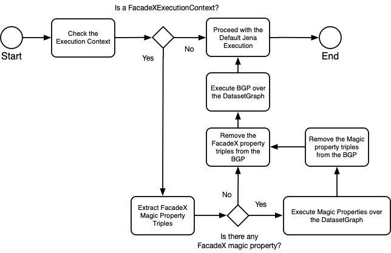
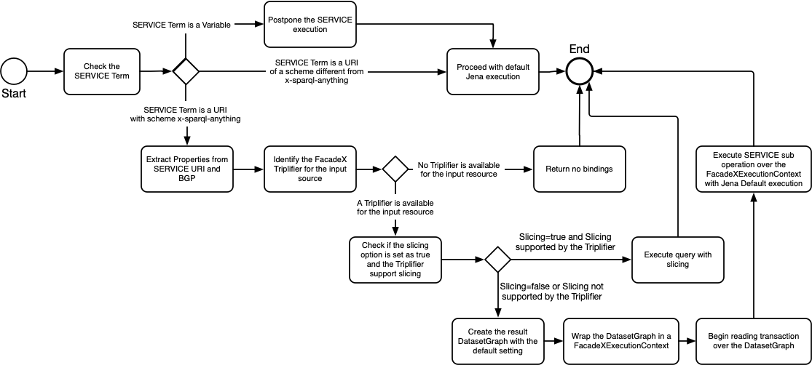

# System overview

### Component Diagram

### Activity Diagram

The following flow charts describe the workflow of the FacadeXOpExecutor (see issue [#293](https://github.com/SPARQL-Anything/sparql.anything/issues/293)).

TBD

### Caching system

By the default, the dataset graphs created by extracting data from the source are not cached.
However, by setting the [`use-cache` option](Configuration.md#use-cache) to true the result of the triplification will be stored into an in-memory cache and used for responding the same query twice.
