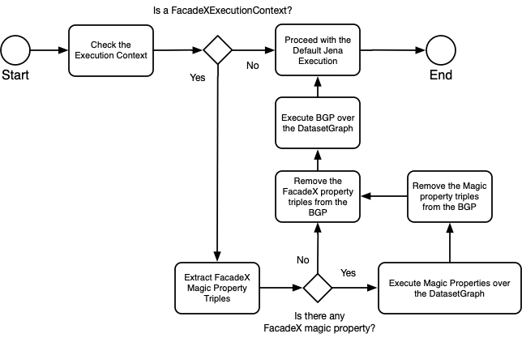
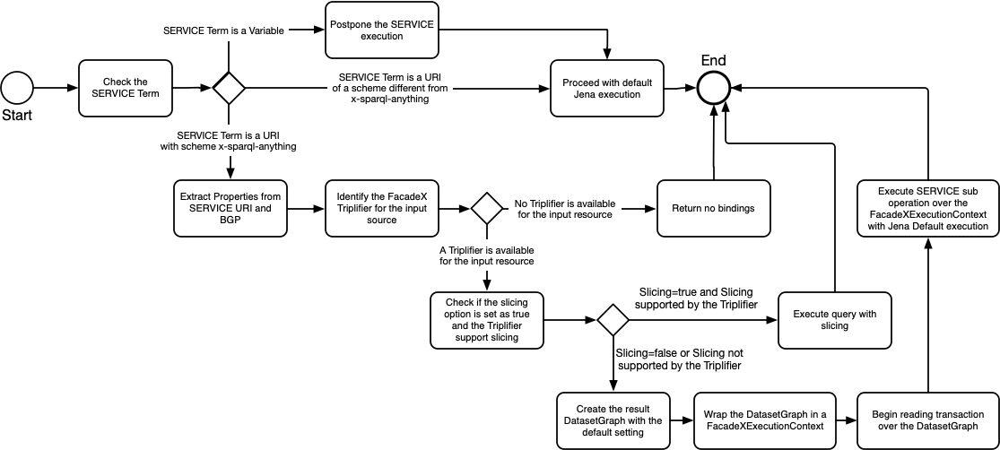

# System overview

### Component Diagram

### Activity Diagram

The following flow charts describe the workflow of the FacadeXOpExecutor (see issue [#293](https://github.com/SPARQL-Anything/sparql.anything/issues/293)).


TBD





### Caching system

SPARQL Anything implements a two-level caching system to optimize performance:

#### Internal Query Cache

The internal query cache is **always enabled** and scoped to a single query execution. This cache:
- Automatically prevents redundant triplification when the same source is accessed multiple times within a query (e.g., nested SERVICE clauses)
- Is automatically created at the start of each query execution
- Is automatically cleared after query completion
- Has minimal memory overhead since it's temporary
- Is **not user-configurable** - it's always on

This internal cache is particularly important for queries with nested SERVICE clauses. Without it, each nested SERVICE call would re-triplify the same data source, causing performance issues and timeouts.

#### User-level Cache (use-cache option)

By setting the [`use-cache` option](Configuration.md#use-cache) to true, the result of the triplification will be stored into an in-memory cache that persists across multiple query executions. This user-level cache:
- Is **disabled by default** (use-cache=false)
- Persists until the process terminates
- Can reuse triplified data across different queries
- Has a higher memory cost as data is retained longer
- Should be enabled when repeatedly querying the same data sources and those data sources don't change

The cache key (for both levels) is a string result of concatenating the translation of the query in SPARQL algebra with the execution properties (either extracted from the query or passed as an argument via the CLI).

**Example:**
```sparql
# Without use-cache: Internal cache still prevents redundant work within this query
SELECT ?name1 ?name2 {
  SERVICE <x-sparql-anything:location=data.json> { ?s :name ?name1 }
  SERVICE <x-sparql-anything:location=data.json> { ?s :name ?name2 }
}
# data.json is triplified only once (internal cache)

# With use-cache=true: Data is cached across queries
SELECT ?name { 
  SERVICE <x-sparql-anything:location=data.json,use-cache=true> { ?s :name ?name } 
}
# Subsequent executions of this query will reuse cached data
``` 